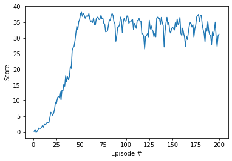

# report

With project recomendation i start coping DDPG-pendulum files and continuous control files, then the first change is in model where i change state size and action size.

After i implement all code by traing an Agent for check if input and output was correct.

The number of nodes in hidden layers (h1, h2) was find by test with (264, 132) and (528, 264) nodes where (264, 132) nodes have best score by the graph.

The batch_size as seted considering enverinmont time stemp and 20 parallel agents.

I have problem with noise and find a fix in class chat where i used np.random.standard_normal(size) instead np.array([random.random() for i in range(len(x))])

this graph show average score for episode.

For future i wound like to consider the sequence of states and actions to use expected return of trajectory.